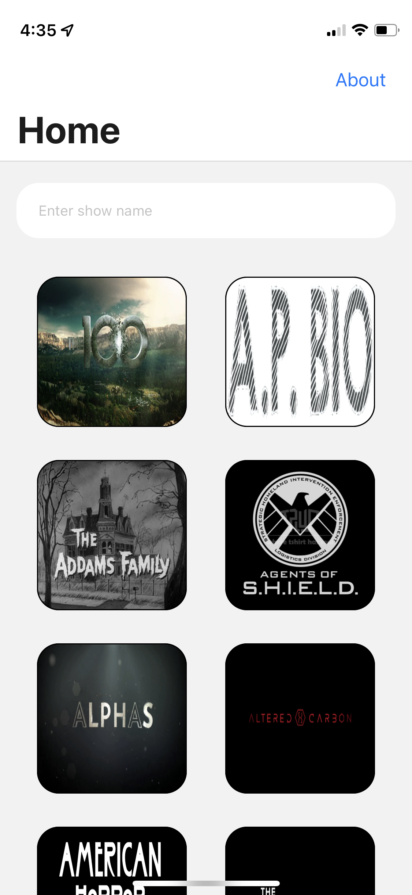
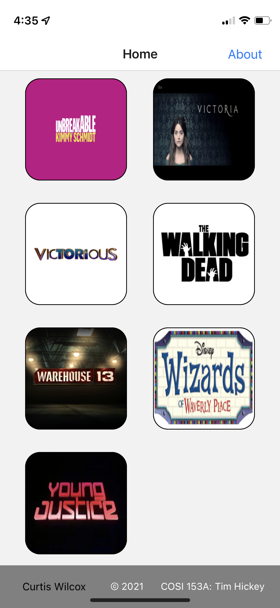
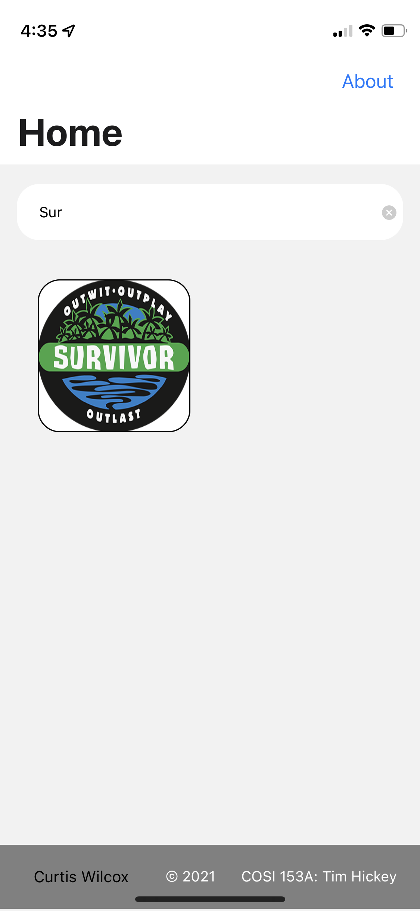
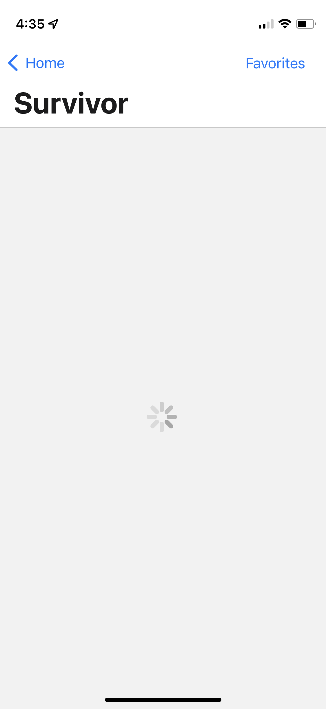
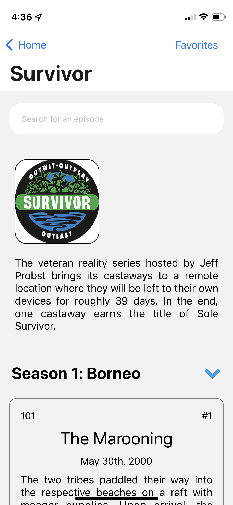
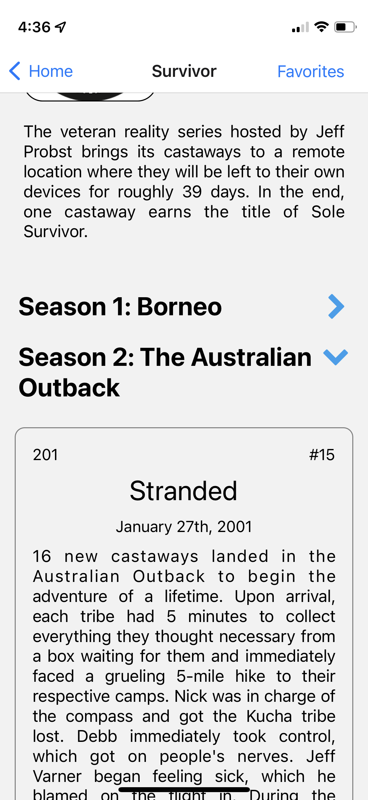
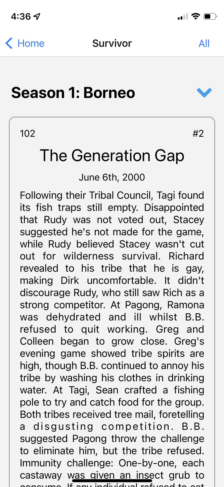
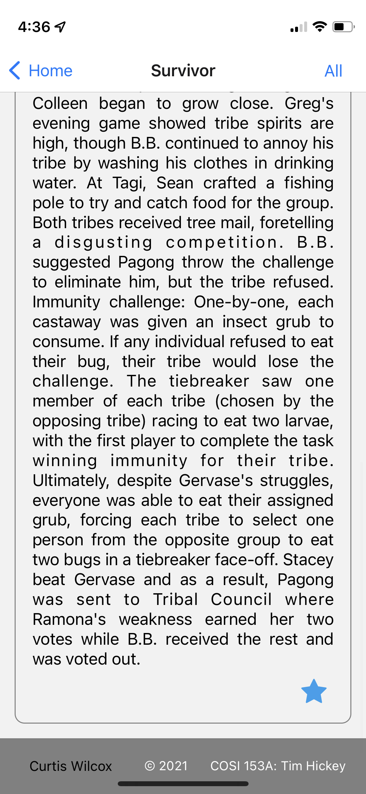

# Show Dictionary
### Curtis Wilcox
### COSI 153A (Fall 2021): Tim Hickey
### CPA 5

---

### Video Link
https://www.dropbox.com/s/qzp3kg8q6q4ag55/cpa-5.MP4?dl=0

### Note
I apologize for the rambling in the video. I was trying to go down the list that was emailed out and was a little scattered! :) Nothing was removed since CPA4, so all requirements are still met.

### Elevator Pitch
The *Show Dictionary* is a quick-and-easy way to find information about episodes of a television show! With over 100 shows to choose from, information such as each episode's name, original release date, the writer(s)/director(s), season/episode number, and summary are readily available for speedy consumption. Should you want to keep track of which episodes you love, you may click on the "favorite star" icon found with each episode to mark when the episode is a favorite, and you can easily filter the list to view only those.

### Developer Notes
The app is based in React Native, and information is obtained from making a `fetch` request to a webpage. The main program page is a `FlatList`, and show-specific information is displayed season-by-season with a `SectionList`. `AsyncStorage` is used to keep device-specific information pertaining to whether or not an episode is a favorite. The `FontAwesome` module supplies the `Icon` component, which renders images like the "favorite" star and the chevron used to collapse seasons in the `SectionList`. Everything else comes directly from `React` / `React Native`.

### Reflection
- What you did well
  - Figuring out `LayoutAnimation` and how to make collapsible sections in the `SectionList`.
  - Removing certain redundancies and improving overall layout.
- What you found challenging (if anything)
  - N/A.
- What are the main features you want your app to have (when you finish it in December!)
  - I would like, at a very high level, the user to be able to select a show that they want to look into and then be able to see information about the show, such as a description of it and also information on all of its episodes. The episodic information would include, but not necessarily be limited to, the title and a summary of the episode, as well as its original airdate, the person or people who wrote and directed it, and view the characters that appeared in certain episodes (not a full cast list, but some of the more "main" or memorable characters, for better ease of finding an episode that one may be trying to recall). Ideally, the user could also mark some episodes as "favorite" to come back to later. I suspect that more ideas will come up as we are shown more and more things in class that I can then incorporate into this app.

### Screen Shots
Initial View (post-load) | Bottom of Initial View | Search Bar is Active
:--------------:|:-----------:|:------------:
 |  | 

Loading Content w/Context and Children View | Content (post-load) | Collapsed Season
:--------------:|:-----------:|:------------:
 |  | 

Showing Favorite (Part 1) | Showing Favorite (Part 2)
:--------------:|:-----------:
 | 
